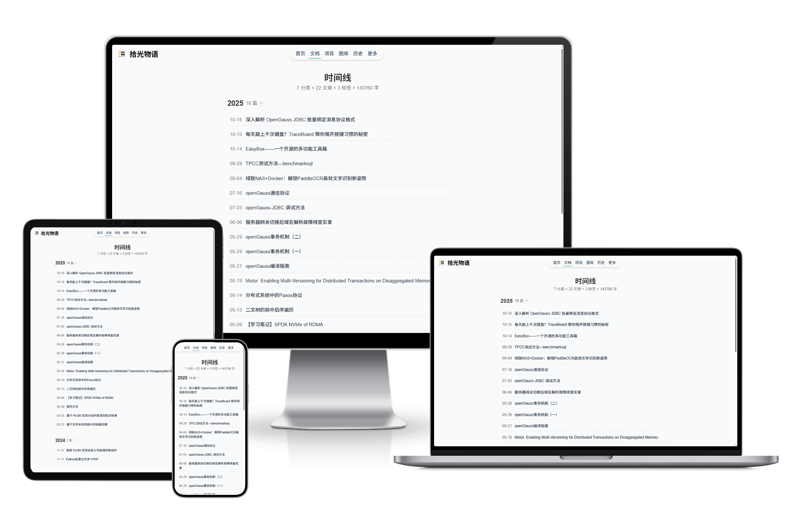

# 一个极简的个人主页




## 特点

- 极简风格的主页
- GitHub数据统计页
- 博客文章展示
- 工具导航
- 响应式布局
- 深浅主题切换

## 安装说明

博客文档使用的是[VanBlog](https://vanblog.mereith.com/)，需要自行安装

### docker 安装

创建docker-compose.yml文件，写入下面内容，根据情况填写对应的环境变量：

```yaml
version: '3.8'

services:
  # 后端服务
  backend:
    image: siyuan044/timelesstales-backend:latest
    restart: always           # 容器退出时自动重启
    expose:
      - "8000"                # 仅内部暴露端口（不直接映射到主机）
    networks:
      - app-network           # 加入自定义网络
    volumes:
      - ./server/data:/app/data  # 主机当前目录的data → 容器内/app/data
    environment:
      - TZ=Asia/Shanghai
      - BLOG_URL='' # vanblog博客地址，(外部可见，如：https://blog.example.com)
      - BLOG_API='' # vanblog API地址，（仅内部调用，如：https://blog.example.com/api）
      - BLOG_TOKEN='' # vanblog访问token （可选）
      - GITHUB_USERNAME='' # GitHub用户名（必填，用于获取用户数据）
      - GITHUB_TOKEN='' # GitHub访问token（可选，但推荐设置以避免速率限制）

  # 前端服务
  frontend:
    image: siyuan044/timelesstales-frontend:latest
    restart: always
    ports:
      - "8081:80"               # 前端端口映射（主机8081端口 -> 容器80端口）
    depends_on:
      - backend               # 前端依赖后端服务启动
    networks:
      - app-network
# 自定义网络（让前后端容器互通）
networks:
  app-network:
    driver: bridge
```

```
docker-compose up -d
```

### docker 打包

```bash
docker-compose build
```

### 前端

[点击查看](./package/website/README.md)

### 后端

[点击查看](./package/server/README.md)